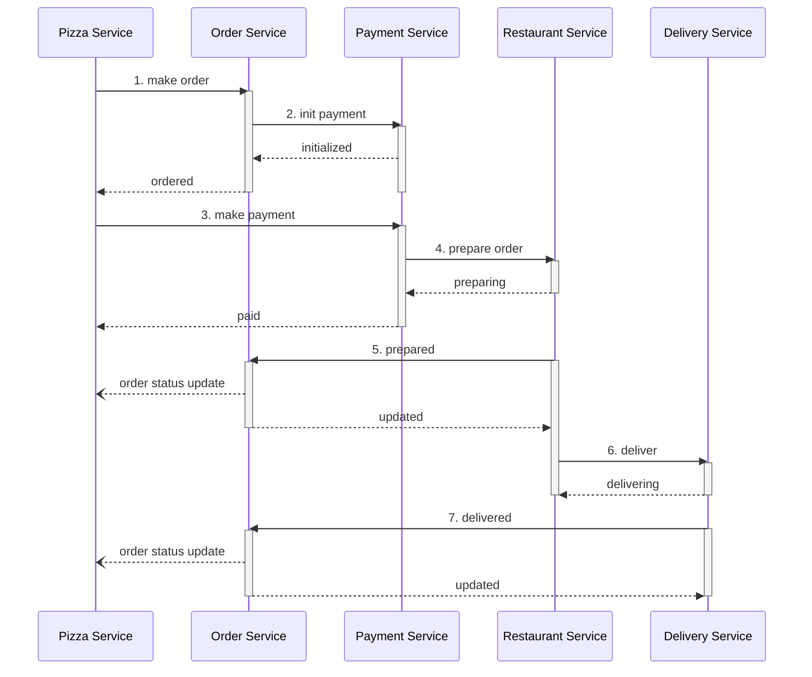

# Pizza Service (Orchestration)

## Communication Flow

```mermaid
sequenceDiagram
    participant PIZZA as Pizza Service
    participant ORDER as Order Service
    participant PAYMENT as Payment Service
    participant RESTAURANT as Restaurant Service
    participant DELIVERY as Delivery Service
    
    PIZZA->>ORDER: 1. make order
    activate ORDER
    ORDER->>PAYMENT: 2. init payment
    activate PAYMENT
    PAYMENT-->>ORDER: initialized
    ORDER-->>PIZZA: ordered
    deactivate PAYMENT
    deactivate ORDER

    PIZZA->>PAYMENT: 3. make payment
    activate PAYMENT
    PAYMENT->>RESTAURANT: 4. prepare order
    activate RESTAURANT
    RESTAURANT-->>PAYMENT: preparing
    deactivate RESTAURANT
    PAYMENT-->>PIZZA: paid
    deactivate PAYMENT

    RESTAURANT->>ORDER: 5. prepared
    activate RESTAURANT
    activate ORDER
    ORDER--)PIZZA: order status update
    ORDER-->>RESTAURANT: updated
    deactivate ORDER
    RESTAURANT->>DELIVERY: 6. deliver
    activate DELIVERY
    DELIVERY-->>RESTAURANT: delivering
    deactivate DELIVERY
    deactivate RESTAURANT

    DELIVERY->>ORDER: 7. delivered
    activate DELIVERY
    activate ORDER
    ORDER--)PIZZA: order status update
    ORDER-->>DELIVERY: updated
    deactivate ORDER
    deactivate DELIVERY
```
